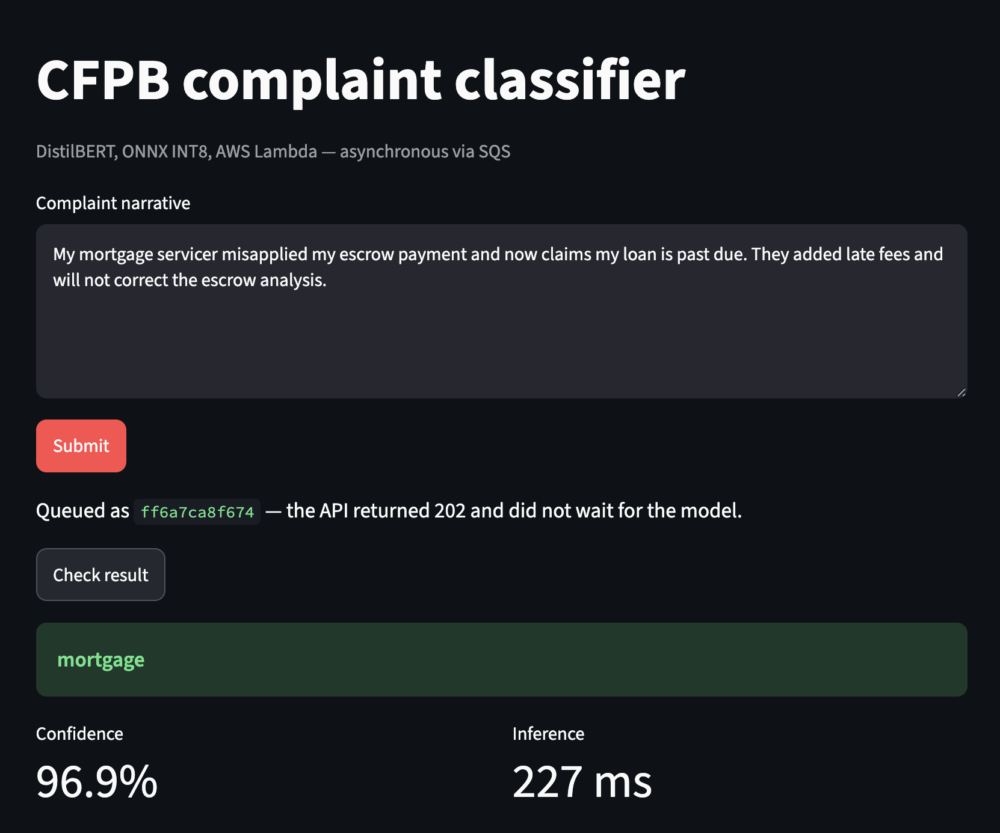
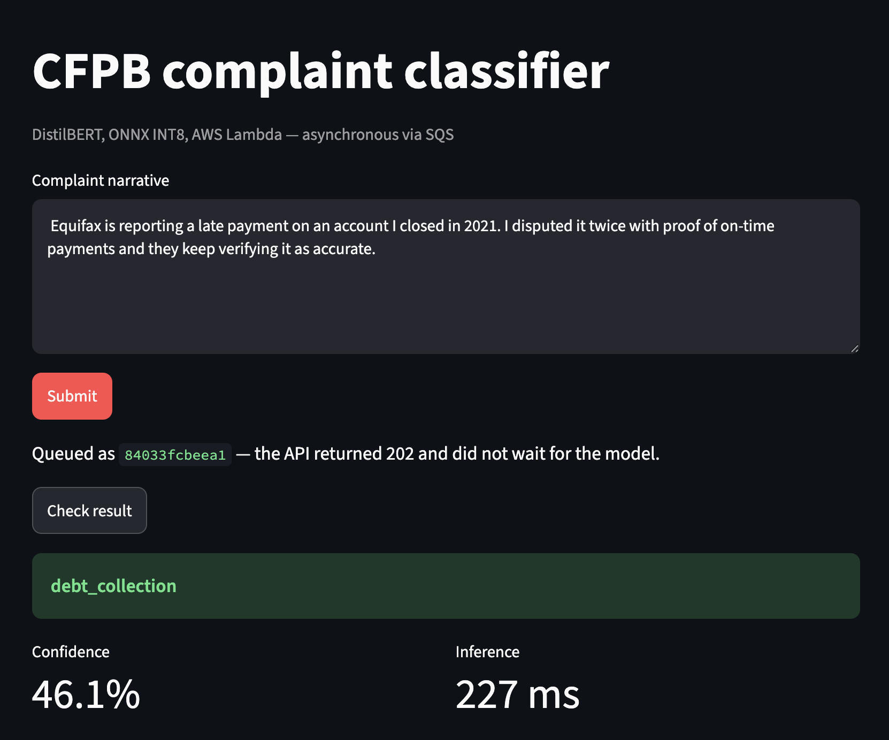
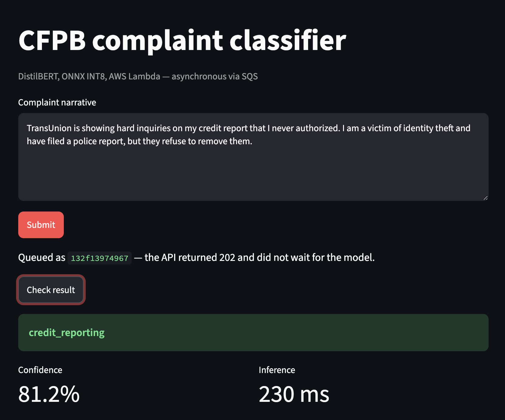
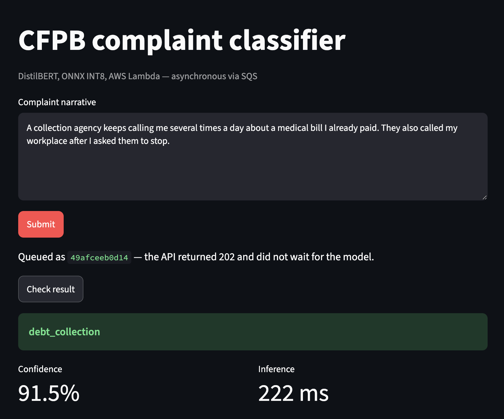
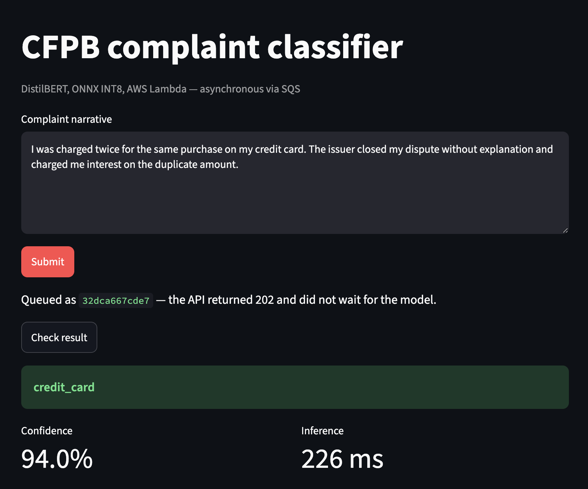
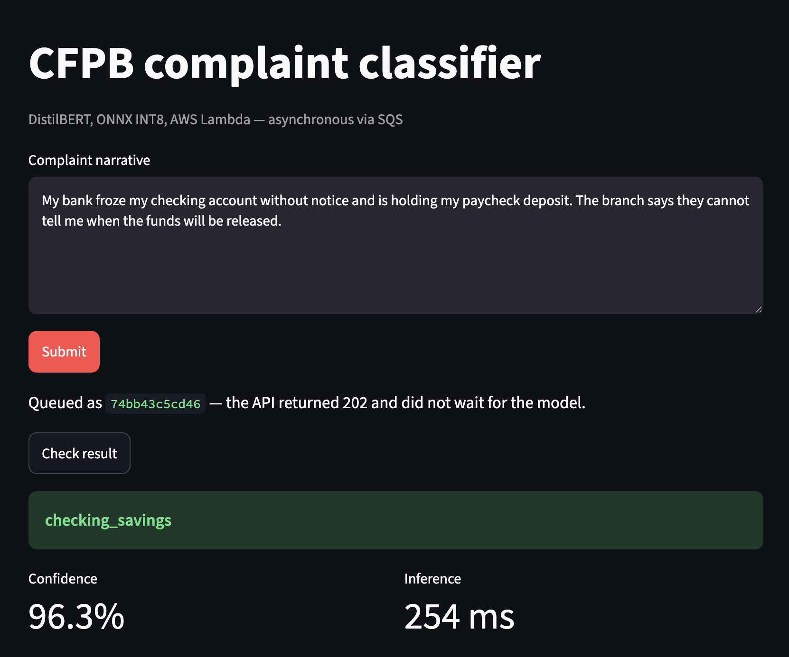
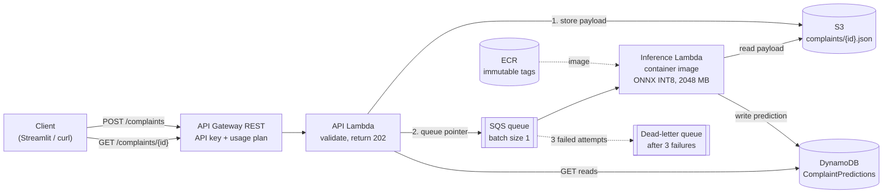
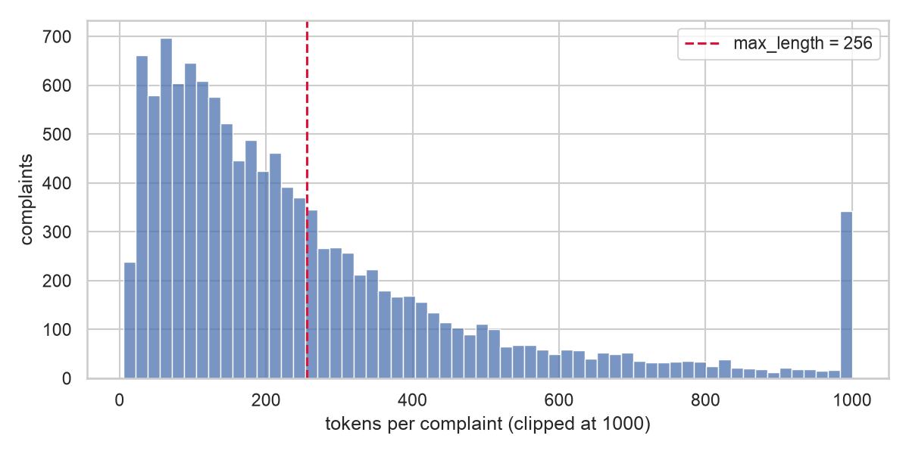
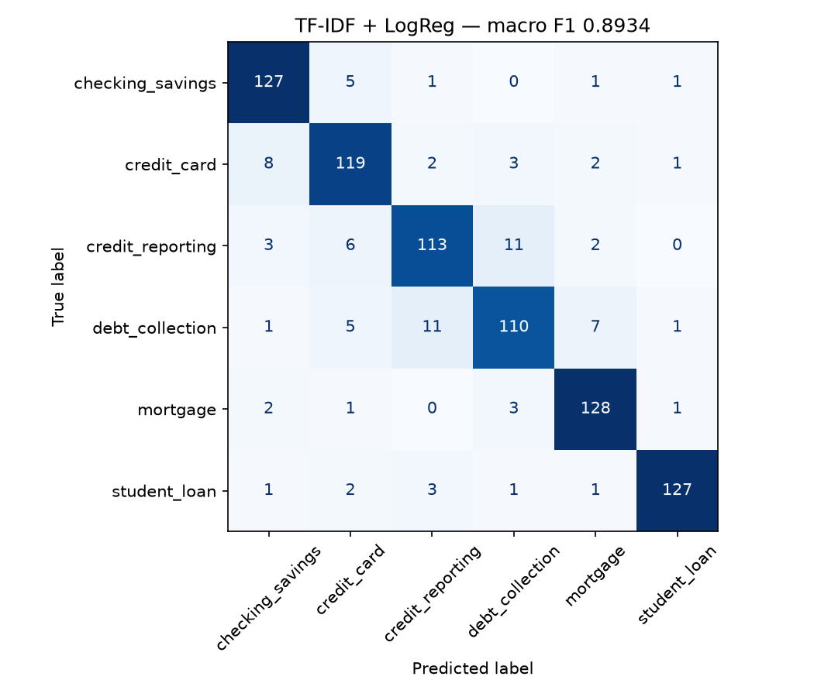
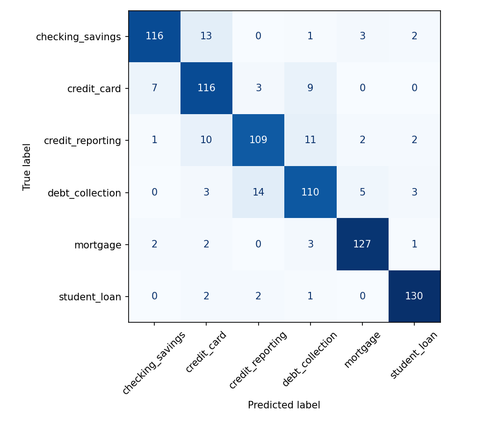

# CFPB Complaint Classifier

**Serverless transformer inference on AWS.** A DistilBERT model that classifies
consumer-finance complaints into six product categories, compressed with ONNX INT8
quantization and served from a container-image AWS Lambda behind an asynchronous,
event-driven pipeline, all provisioned with Terraform.

The goal was not just a model, but evidence: a classical baseline to beat, measured
accuracy, size, latency and cost at every step, and an honest account of what did not work.

| | |
|---|---|
| Model size | **268 MB → 67 MB** (INT8, 3.98× smaller), no measurable macro-F1 loss |
| Warm latency on Lambda | **158 ms p50** at 3008 MB, 229 ms at 2048 MB |
| Cost | **~$0.024 per 1,000 predictions** (list-price estimate); **$0** actually spent |
| Infrastructure | 28 AWS resources in Terraform, validated on a local AWS emulator first |
| Surprise | the TF-IDF baseline (**0.893** macro-F1) beat DistilBERT (**0.874**) |

<p>
  
  
</p>

*Left: a correct, confident prediction. Right: a real miss (a credit-reporting complaint
labelled `debt_collection`), with confidence to match: 46.1%.*

<details>
<summary>One prediction per category, from the deployed API</summary>
<p>
  
  
  
  
  
  
</p>
</details>

---

## Contents

- [Results](#results)
- [Architecture](#architecture)
- [Data](#data)
- [Model](#model)
- [Reproducing it](#reproducing-it)
- [Lessons learned](#lessons-learned)
- [Limitations and future improvements](#limitations-and-future-improvements)

---

## Results

### Model quality and size

Test split: 810 complaints, 135 per class.

| | TF-IDF + LogReg | DistilBERT (PyTorch) | ONNX FP32 | ONNX INT8 (deployed) |
|---|---|---|---|---|
| Macro-F1 | **0.8934** | 0.8741 | 0.8741 | 0.8756 |
| Accuracy | 0.8938 | 0.8741 | 0.8741 | 0.8753 |
| Model size | — | 268 MB | 268 MB | **67.4 MB** |
| CPU scoring (batched) | — | — | 171.8 ms/row | **110.3 ms/row** |

- **The baseline wins** by 1.9 points of macro-F1, and on five of six classes.
  DistilBERT is ahead only on mortgage. The result is reported as measured rather than
  tuned until the transformer came out ahead.
- **The ONNX export is faithful**: FP32 ONNX reproduces the PyTorch score exactly.
- **INT8 quantization cost nothing measurable**: +0.0015 macro-F1 is within noise on
  810 rows, for a 74.9% smaller model that scores 1.56× faster on CPU.

### Serving on AWS Lambda

Measured from CloudWatch `REPORT` lines. Warm = invocations without `Init Duration`;
18-25 warm invocations per row. Cold init is a single sample at 1024 and 3008 MB.

| Lambda memory | Warm p50 | Warm p95 | Cold init | Max memory used | Inference cost / 1k |
|---|---|---|---|---|---|
| 1024 MB | 593 ms | 654 ms | 1.95 s | 359 MB | $0.0099 |
| 2048 MB (configured) | 229 ms | 326 ms | 2.2 s (avg of 3) | 339 MB | $0.0076 |
| 3008 MB | **158 ms** | **170 ms** | 1.28 s | 343 MB | $0.0077 |

- **More memory was cheaper, not dearer.** Memory use never exceeded ~360 MB, so the extra
  memory only buys CPU (Lambda allocates vCPU in proportion to memory). At 1024 MB the
  function runs 2.6× slower, which makes it **29% more expensive per request** than 2048 MB.
  3008 MB is **31% faster** than 2048 MB for **1% more** cost.
- **Latency is constant per request**: every input is padded to 256 tokens, so a one-line
  complaint costs the same compute as a long one (both screenshots above: 227 ms).

### Cost

Estimated from measured latency and list prices (us-east-1, before Free Tier), for one
prediction = POST + inference + GET:

| Component | $ per 1,000 |
|---|---|
| Inference Lambda compute (2048 MB, 229 ms p50) | 0.0076 |
| API Gateway REST (2 requests) | 0.0070 |
| S3 (1 PUT, 1 GET) | 0.0054 |
| SQS, CloudWatch Logs, DynamoDB, Lambda requests, API Lambda | 0.0040 |
| **Total** | **~$0.024** |

The model is only about **a third** of the cost of a prediction; at this latency, the
request plumbing (API Gateway and S3) costs more than the inference.
**Actual spend for the whole project: $0.00**: everything stayed inside Free Tier.

---

## Architecture



**Request flow.** `POST /complaints` stores the text in S3, queues a *pointer* to it on
SQS, and returns **202 Accepted** immediately; the API never waits for the model. The
inference Lambda picks the message up, reads the text, predicts, and writes the result to
DynamoDB. `GET /complaints/{id}` returns it, or `pending_or_unknown` until it exists.

**Design decisions, and why:**

- **Asynchronous via SQS.** The front door stays fast regardless of model latency, and the
  inference tier can retry, back up and fail without affecting it.
- **The message carries a pointer, not the text.** SQS caps messages at 256 KB; S3 has no
  practical limit, and keeps the raw input for re-scoring after a model change.
- **SQS visibility timeout = 6 × the Lambda timeout** (360 s vs 60 s), which AWS requires for
  an event source mapping. Batch size 1, so one bad message fails alone; 3 attempts, then
  the dead-letter queue.
- **One API Lambda for both routes.** The security boundary that matters is between the API
  tier and the inference tier, and that is kept: two **mirror-image IAM roles** (API writes
  S3, reads DynamoDB; inference reads S3, writes DynamoDB), every permission scoped to a
  single resource ARN, no wildcards.
- **REST API (v1), not HTTP API (v2)**, because API keys and usage plans exist only in v1.
  The key with its usage plan (5 req/s, 1,000/day) is a **spending guard against scanners,
  not authentication**.
- **The model is baked into the container image**, never fetched at runtime, and loaded
  once per container at module scope so only cold starts pay for it.
- **Serving dependencies are separate from training dependencies.** The image runs
  `onnxruntime` and the standalone `tokenizers` library, with no PyTorch or Transformers.
- **ECR tags are immutable.** Re-pushing a tag fails loudly instead of leaving Lambda on the
  old image (see lessons learned).
- **Teardown-safe by default.** Log groups are declared in Terraform with 7-day retention
  (Lambda would otherwise create them with never-expire retention, outside Terraform), and
  the bucket and repository allow `destroy` while non-empty. DynamoDB is on-demand, so
  nothing bills while idle.

---

## Data

The source is the CFPB Consumer Complaint Database, in which consumers describe a problem
with a financial product in their own words.

**The data source changed mid-project.** In September 2026 CFPB stopped publishing complaint
narratives: the public API, the bulk CSV, and even previously retrieved records lost the
text field. The pipeline was rebuilt on a public-domain (CC0) snapshot of 1.69M
narrative-bearing complaints (`BEE-spoke-data/consumer-finance-complaints` on Hugging Face),
using January 2023 to February 2024.

**Preparation** (`src/preprocessing/`):

- **Six categories**: credit reporting, debt collection, mortgage, credit card,
  checking/savings, student loan. CFPB renamed two of these during 2023, so each label
  merges every product name it covers; prepaid cards are excluded from credit card.
- **De-duplication**: 708 of 12,000 sampled rows shared their text with another row, mostly
  copy-pasted dispute letters (one appeared 85 times), and 11 texts were filed under
  conflicting labels. Left in, the same text would land in both train and test and inflate
  every score.
- **Balanced** at 1,350 per class (8,100 rows), then a stratified 80/10/10 split
  (6,480 / 810 / 810), seed 42.



**35% of complaints exceed the 256-token input** and are truncated (mortgage complaints are
the longest, with a median of 272 tokens). This trade-off was accepted to keep latency and
memory down, and is the first candidate for improving accuracy.

Exploration is in [`notebooks/01_data_exploration.ipynb`](notebooks/01_data_exploration.ipynb).

---

## Model

**Baseline**: TF-IDF (word 1-2 grams, 50k features, sublinear TF) + logistic regression with
balanced class weights. Fits in 7 seconds on a laptop CPU.

**Transformer**: `distilbert-base-uncased`, fine-tuned on a Colab T4 for 2 epochs (lr 2e-5,
batch 16, max length 256, mixed-precision training), with the best checkpoint chosen on
**validation** macro-F1 and the test set untouched until the end.

<p>
  
  
</p>

*Left: TF-IDF baseline. Right: DistilBERT. Same 810 test complaints.*

The largest confusion, for both models, is **debt collection ↔ credit reporting** (22 errors
for the baseline, 25 for DistilBERT): debt complaints usually also describe what the
collector reported to the credit bureaus. DistilBERT also leaks checking/savings complaints
into credit card (13), which the baseline mostly avoids.

**Why the baseline wins.** Product names appear literally in most complaints ("mortgage",
"student loan"), which is exactly the signal TF-IDF captures; DistilBERT had 2 epochs on
6,480 rows and sees only the first 256 tokens.

**Single-label by design.** The model picks exactly one of six categories (softmax over
mutually exclusive classes), because each CFPB complaint has one product. A complaint that is
genuinely about two products still gets one answer, often confidently: *"A debt collector
is reporting an account on my credit report that is not mine…"* is classified
`debt_collection` at 90.6%, with credit reporting at 5.0%.

**Optimization.** `model/export_onnx.py` exports to ONNX (opset 14, dynamic batch axis) and
verifies the graph loads in ONNX Runtime; `model/quantize.py` applies dynamic INT8
quantization; `model/evaluate_onnx.py` scores any ONNX file on the test split. Note that
mixed-precision *training* (fp16) and INT8 *inference* quantization are separate steps.

---

## Reproducing it

### Repository layout

```
src/preprocessing/   fetch the snapshot, clean, balance, split
src/baseline/        TF-IDF + logistic regression baseline
notebooks/           data exploration; Colab fine-tuning notebook
model/               ONNX export, INT8 quantization, evaluation; labels and metadata
lambda/ingestion/    API Lambda (POST and GET)
lambda/inference/    inference Lambda (SQS and direct invoke)
docker/inference/    Lambda container image
terraform/           all AWS infrastructure
tests/               contract tests (pytest + moto)
scripts/             local AWS emulator bootstrap
streamlit/           thin client for the deployed API
deploy.sh            three-phase deploy
```

### Data, baseline and model

```bash
python -m venv .venv && source .venv/bin/activate
pip install -r requirements-dev.txt

python src/preprocessing/fetch_cfpb_data.py      # downloads the snapshot once (~0.9 GB)
python src/preprocessing/build_dataset.py        # -> data/{train,val,test}.parquet, model/labels.json
python src/baseline/tfidf_baseline.py
```

Fine-tune with `notebooks/02_distilbert_colab.ipynb` on a Colab T4 (upload the three
parquet files; 10-20 minutes), unzip the result into the repo root, and point `--src` at
the folder that contains `config.json`:

```bash
python model/export_onnx.py --src ./distilbert-complaints --labels model/labels.json
python model/quantize.py
python model/evaluate_onnx.py --model model/model_int8.onnx --report
```

### Test

```bash
pytest tests/ -q                                  # 5 contract tests, ~3 s
```

### Run locally (no AWS account needed)

The full pipeline runs on [Floci](https://hub.docker.com/r/floci/floci), a local AWS
emulator that executes the Lambda container for real:

```bash
docker build --platform linux/amd64 -f docker/inference/Dockerfile -t complaint-inference:v3-int8 .
docker compose up -d
./scripts/floci_bootstrap.sh                      # prints the local API URL
```

`compose.yaml` adds a small `socat` sidecar: on Docker Desktop for Mac, Floci cannot reach
the Docker socket directly, so it connects through TCP instead.

### Deploy to AWS

Requires the AWS CLI (signed in), Docker and Terraform. Always use a tag that has never
been pushed:

```bash
./deploy.sh v4-int8
```

It creates the ECR repository, rebuilds and pushes the image, then applies everything else.
Terraform asks for confirmation at both applies. The API URL and key ID are printed at the end.

```bash
COMPLAINTS_API_URL="$(terraform -chdir=terraform output -raw invoke_url)" \
COMPLAINTS_API_KEY="<key value>" \
streamlit run streamlit/app.py
```

### Tear down

```bash
terraform -chdir=terraform destroy -var image_tag=v4-int8
```

Then confirm in the console or CLI that nothing is left: Terraform only removes what it created.

---

## Lessons learned

- **A stale image ran old code with no error anywhere.** The first end-to-end run returned
  `null`: the container was built before the SQS handler existed, and reusing an image tag
  meant nothing flagged it. Hence immutable ECR tags, and a deploy script that always
  rebuilds.
- **The data source disappeared.** CFPB withdrew complaint narratives mid-project, and the
  first sign was an API that still answered, just without the text. Verifying the data
  itself, not only the response code, is what caught it.
- **Measurement overturned intuition twice**: the simple baseline beat the transformer, and
  more Lambda memory was cheaper per request than less.
- **The emulator was not AWS.** Floci does not enforce IAM. On real AWS, a request for a
  missing S3 object came back as `AccessDenied` rather than `NoSuchKey`, because S3 hides
  whether a key exists from callers without `s3:ListBucket`. Least privilege had made
  errors less informative, a trade-off that only shows up on the real service.
- **Safety margins have a cost.** The 6× visibility rule that prevents duplicate processing
  also means a failing message takes ~17 minutes to reach the dead-letter queue.
- **Small portability traps**: macOS ships bash 3.2, where an empty array is an error under
  `set -u`, and zsh does not split unquoted variables. Each broke a script once.

---

## Limitations and future improvements

- **Orphaned objects.** The API writes to S3 and then sends to SQS; if the send fails, the
  payload is stored but never scored. S3 event notifications (or an outbox pattern) would
  make the two a single step.
- **Partial batch failures.** Batch size 1 keeps one bad message from failing others;
  `ReportBatchItemFailures` would allow larger batches safely.
- **Dynamic padding.** Padding every input to 256 tokens wastes compute on short complaints.
- **Longer inputs.** 35% of complaints are truncated; a longer window or summarisation
  first could recover accuracy, at a latency cost.
- **Low-confidence routing.** When the model is wrong, its confidence tends to be low (46%
  above). Sending low-confidence predictions to human review would turn that into a feature.
- **Real authentication.** The API key is a spending guard. An HTTP API with a Lambda or
  IAM authorizer would be the production choice.
- **CI/CD.** Deploy from GitHub Actions with OIDC instead of local credentials.
- **Memory setting.** The measurements favour 3008 MB over the configured 2048 MB: 31%
  faster at the same cost.
